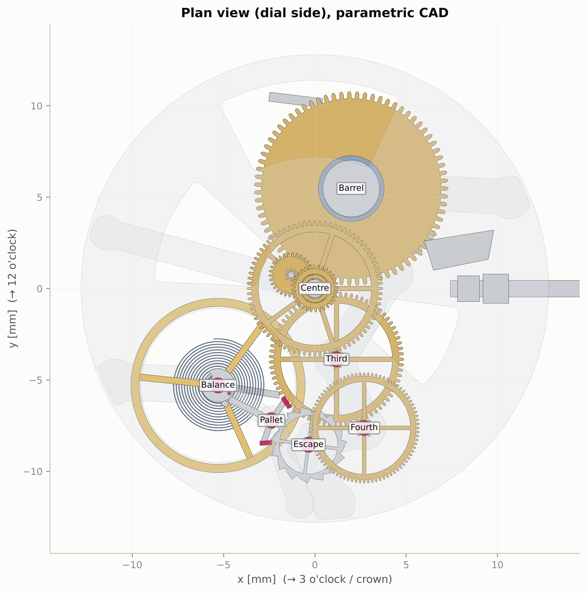

# Miyota 82S0 Digital Twin — Timex TWEG16716 Skeleton Automatic

**Author:** Anwesh Ajitabh Dash

This is a reverse-engineered, physics-based digital twin of my Timex E-Class *Full Skeleton Automatic*
(ref. TWEG16716). It is powered by a **Miyota (Citizen) Cal. 82S0**: 21,600 vph, 21 jewels, a
Swiss-lever self-winding movement. The project rebuilds the movement as a parametric CAD assembly
and simulates it from the mainspring through the gear train and the event-resolved lever
escapement to the balance and hairspring. It then predicts amplitude, rate, beat error, energy
flow, positional errors and power reserve, and validates them against Miyota's specifications,
closed-form theory and an independent brute-force integration.



## Headline results (full wind, dial up)

| | Model | Reference |
|---|---|---|
| Balance amplitude | **270.8°** (vertical: 227°) | typical healthy 250–310° |
| Rate | **−4.6 s/day** | Miyota spec −20…+40 s/day |
| Posture difference (DU, CD, CL, CR) | **4.7 s/day** | spec < 50 s/day |
| Beat error | **0.59 ms** | — |
| Power reserve | **42.0 h** (calibrated; blind estimate 47.7 h) | Miyota 42 h, Timex 40 h |
| Power: mainspring → escape wheel → balance | **0.77 → 0.60 → 0.30 µW** | — |
| Efficiency train / escapement / overall | **79 % / 50 % / 39 %** | — |
| Energy-ledger closure | **10⁻¹³** relative | conservation of energy |
| Out-of-poise error vs J₁(A)/A theory | **≤ 0.03 s/day** at 12 amplitudes | independent averaging theory |
| Multi-time-scale reserve vs ≈10⁶-event brute force | **0.15 %** | — |

Full tables are in [`docs/05_results.md`](docs/05_results.md), and the 29 validation checks are in
[`docs/04_validation_report.md`](docs/04_validation_report.md).

## What's inside

| Requirement | Where |
|---|---|
| Watch and movement identification, component inventory, architecture | [`docs/01_identification_and_architecture.md`](docs/01_identification_and_architecture.md) |
| Parameter database (133 inputs, each **measured / sourced / inferred / assumed**) | [`config/watch.yaml`](config/watch.yaml) → [`docs/02_parameter_database.md`](docs/02_parameter_database.md) |
| Governing equations for every result | [`docs/03_theory.md`](docs/03_theory.md) |
| Parametric CAD: cycloidal gears, layout synthesis, 75 parts, STEP/GLB | `src/twin/geometry/`, `outputs/cad/` |
| Kinematic simulation (all wheel speeds and directions from tooth counts) | `src/twin/kinematics/train.py` |
| Mainspring, barrel and train-loss model | `src/twin/dynamics/mainspring.py`, `train_losses.py` |
| Event-driven Swiss-lever escapement + balance (numba) | `src/twin/dynamics/hybrid.py`, `simulator.py` |
| Power reserve (multi-time-scale) + brute-force validation | `src/twin/dynamics/power_reserve.py`, `tools/validate_reserve_bruteforce.py` |
| Timekeeping, positions, isochronism, error decomposition | `src/twin/analysis/` |
| Self-winding rotor model | `src/twin/dynamics/autowinding.py` |
| Sensitivity (OAT) and Monte-Carlo uncertainty propagation | `src/twin/analysis/sensitivity.py` |
| Interactive 3-D viewer + engineering dashboard | `web/app/` → `outputs/web/*.html` |
| Validation and test suite | `tests/` (68 tests), `src/twin/analysis/validation.py` |
| Assumptions and limitations | [`docs/06_assumptions_and_limitations.md`](docs/06_assumptions_and_limitations.md) |

## Running it

```bash
python -m venv .venv && source .venv/bin/activate     # Windows: .venv\Scripts\activate
pip install -r requirements.txt
export PYTHONPATH=src                                  # Windows (PowerShell): $env:PYTHONPATH="src"

python -m pytest                                       # 68 tests, ~25 s
python -m twin run-all                                 # everything: CAD, simulations, figures, data, report, web app (~6 min)
python -m twin run-all --no-step                       # same, skipping the slow STEP export
```

Then open **`outputs/web/miyota_82S0_twin_offline.html`** in any browser. It is a single file with no
server, and it works offline.

### Experiments

```bash
# change any parameter in config units and compare every output with the baseline
python -m twin experiment --set balance.inertia_scale=1.01
python -m twin experiment --set escapement.pallet_friction_coeff=0.2 --set damping.q_air=400
python -m twin experiment --set train.barrel_teeth=80 --no-reserve

python -m twin sensitivity --workers 4     # one-at-a-time study  -> outputs/analysis/oat.pkl
python -m twin montecarlo --n 200          # uncertainty propagation -> outputs/analysis/mc.pkl
python -m twin bruteforce DU               # ~1 h: full event-by-event integration of the reserve
python -m twin params                      # regenerate the parameter tables from config
```

Edit **`config/watch.yaml`** to change anything. It is the single source of truth: dimensions,
tooth counts, materials, friction, damping, escapement angles, CAD z-stack and solver settings. All
values are written in engineering units and converted to SI internally.

### Interactive viewer controls

- **Navigate:** drag to orbit, scroll to zoom, click a part to inspect it (Miyota part number, speed, period); **Isolate selection** shows only that assembly.
- **Escapement:** **Event ◀ ▶** steps through unlock → impulse → drop → lock; **Slow-mo** shows it at 1/500 speed.
- **Time:** **3600×** drains the power reserve in real time. **Pull crown** hacks the balance; **Wind crown** and **Wrist motion** rewind it.
- **Display:** skeleton mode, explode slider, bridges/dial toggles, labels, rotation arrows, and torque/power flow labels.
- **Dashboard tabs:** Live (13 KPIs + 6 time-history plots), Escapement, Timekeeping, Experiments, Validation, Parameters.

## Outputs

| Folder | Contents |
|---|---|
| `outputs/figures/` | 25+ publication figures, including CAD views, the six required time histories, escapement beat, isochronism, unpoise vs theory, positions, tornado charts, Monte-Carlo and brute-force validation |
| `outputs/data/` | CSV: wheel speeds, meshes, kinematic time series, escapement events, power-reserve curves per position, positional tables; `summary.json` |
| `outputs/cad/` | `movement_82S0.step` (B-rep assembly, 71 bodies, mm), `movement_82S0.glb`, `component_table.csv`, `layout.json` |
| `outputs/web/` | The interactive app: CDN version (for publishing) and offline single file |
| `outputs/validation/` | Calibration record and brute-force data |

## Method in one paragraph

The physics is built bottom-up. Exact kinematics come from tooth counts anchored to the 3 Hz time
base. The mainspring is modelled with Euler–Bernoulli bending under a strength limit. Torque passes
through the train with mesh and pivot efficiencies. The balance obeys
I θ̈ + c θ̇ + T_c sgn θ̇ + kθ = gravity + escapement. The lever escapement is a **hybrid automaton** with
unlocking, unilateral impulse contact (wheel lag and catch-up), drop, lock and banking impacts.
Every event is located to 1 ns, and every dissipation channel is integrated, so energy closes to
machine precision. Because the amplitude settles in about 30 s and the mainspring changes over
hours, the reserve is computed from the escapement's limit cycle (a Poincaré-map fixed point) at
each state of wind. This is validated against a full 48-hour, million-event integration.

## Provenance and honesty

Miyota publishes the specifications and parts list but not the internal geometry. Every
unpublished quantity is marked *assumed* with a rationale and a plausible range, constrained
wherever possible by verified data, and exercised in the Monte-Carlo study. **One** parameter (the
mainspring's usable-development factor) is calibrated, so that the reserve matches Miyota's 42 h.
Its blind value and blind prediction are recorded. The power reserve is therefore not used as
evidence of validity; the amplitude, rate, posture difference and theory comparisons are.
