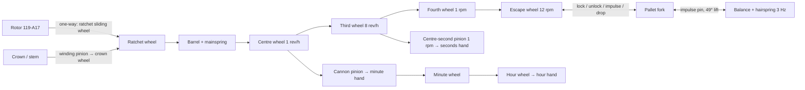
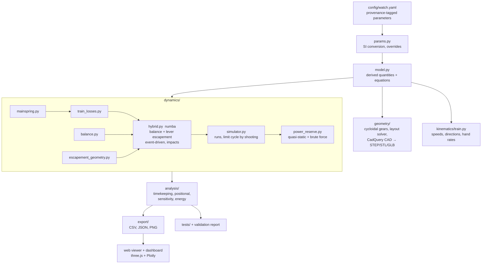
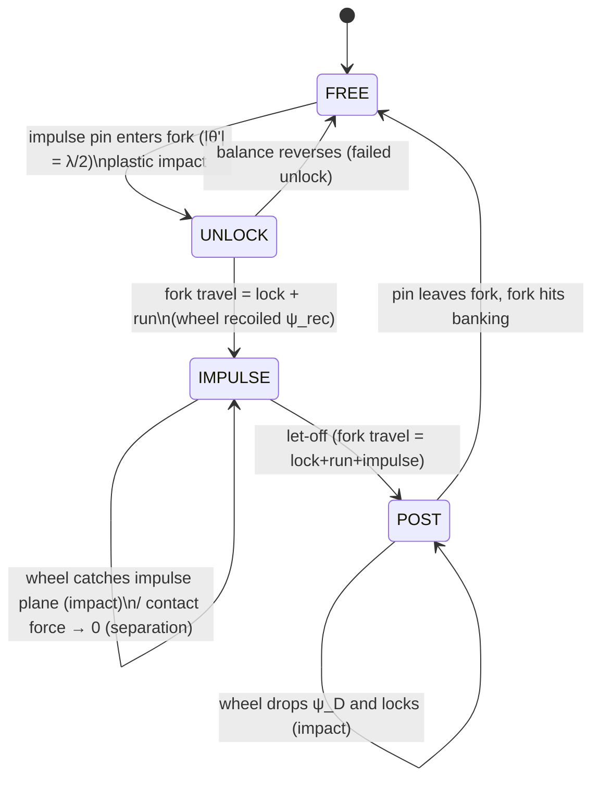

# Phase 1 — Identification, reverse engineering and simulation architecture

**Project:** Digital twin of a Timex skeleton automatic watch
**Author:** Anwesh Ajitabh Dash
**Inputs used:** two owner photographs (`data/photos/dial_side.jpg`, `data/photos/caseback.jpg`), owner
statements (calibre, hacking, beat count), Miyota official documents for Cal. 82S0 (product page, specification
sheet, parts list), Timex retailer listings, Grail Watch Reference and Caliber Corner movement data.

---

## 1. Identified watch and movement architecture

### 1.1 Watch

| Item | Value | Evidence | Provenance |
|---|---|---|---|
| Brand / collection | Timex E-Class "Full Skeleton Automatic" | Dial print "TIMEX", "AUTOMATIC"; retailer listings | measured + sourced |
| Reference | **TWEG16716** (black dial, black leather) | Caseback engraving "TW?G16716-E5" (one letter obscured by glare) | measured |
| Case diameter | 44 mm | Caseback engraving "44 MM CASE" | measured |
| Case material | stainless steel | Caseback engraving "ALL STAINLESS STEEL" | measured |
| Water resistance | 50 m | Caseback engraving "WATER RESISTANT 50M" | measured |
| Jewels | 21 | Caseback engraving "21 JEWELS AUTOMATIC" | measured |
| Listed power reserve | 40 h | Timex retailer listing; owner statement | sourced |
| Case thickness / lug width | 13.15 mm / 22 mm | Sibling 44 mm E-Class model TWEG16720 — **not verified** | assumed |

### 1.2 Movement: Miyota (Citizen) Cal. **82S0**

| Evidence | Observation on this watch | Consistent with 82S0? |
|---|---|---|
| Owner statement | "Miyota 82S0 automatic, 21 jewels, 40 h" | ✔ |
| Jewel count | 21 (engraved) | ✔ 21 jewels |
| Frequency | Owner counted **6 seconds-hand steps per second** | ✔ 21,600 vph |
| Hacking | Owner: seconds hand **stops** when crown is pulled | ✔ "Stop second device" |
| Display | Central hours, minutes, seconds; no date | ✔ 3 hands |
| Balance position | Photogrammetry: balance centre at 223° (median; 209–240°), r ≈ 7.6 mm, **≈7:30 seen from the dial** | ✔ 82 family: balance at 4:30 seen from caseback = 7:30 dial side; open heart at 7:00 |
| Balance diameter | 9.52 mm (caseback photo) / 9.57 mm (dial photo) | plausible for 11½‴ |
| Rotor | central half-disc oscillating weight | ✔ central rotor |

**Architecture** — mechanical, self-winding, 11½‴ (Ø 25.6 mm, casing Ø 26.0 mm, height 5.67 mm):

* **Energy:** mainspring in a going barrel (barrel complete 001-870) with slipping bridle; ratchet wheel 059-560 with click 060-390.
* **Going train:** barrel → centre wheel & pinion (012-116) → third wheel & pinion (017-760) → fourth wheel & pinion (023-940) → escape wheel & pinion (032-106).
* **Indirect centre seconds:** a separate **centre second pinion** (025-670), passing through the hollow centre arbor, is driven by the **third wheel**. A **seconds-pinion friction spring** (903-690) removes the backlash. This is the source of the well-known "82-family seconds-hand stutter".
* **Escapement:** Swiss lever. Jewelled pallet fork & staff (035-560), pallet bridge (708-095), 15-tooth escape wheel (tooth count assumed).
* **Oscillator:** balance with hairspring, regulated (039-102), with regulator index. Two shock settings ("spiral spring with jewel" 098-090) plus mounted cap jewels.
* **Motion works:** cannon pinion on the centre arbor → minute wheel & pinion (072-520) → hour wheel (075-124).
* **Keyless & setting:** stem 065-212 → clutch wheel 064-450, setting lever 067-860, yoke 071-A04, setting wheel 076-430. Hand winding goes through the crown wheel 058-360 to the ratchet.
* **Automatic winding (unidirectional):** oscillating weight 119-A17 → reversing wheel 141-190 → **ratchet sliding wheel** 087-250 with its spring 078-150 (one-way clutch) → reduction wheel & pinion 088-120 → ratchet wheel.
* **Hacking:** brake lever for second hand 269-408 + connection lever 273-201 stop the balance when the crown is pulled.
* **Structure:** main plate, single "barrel and train wheel bridge" (701-F52), centre wheel cock (711-074), pallet bridge, balance bridge (350-020), minute-train cover, hour-wheel guard.

> The skeleton sibling Cal. **8N24** uses the *same* balance (039-102), escape wheel (032-106), pallet fork
> (035-560), third/fourth wheels and barrel (001-870). The dynamic model is therefore identical for both
> calibres; only plate cut-outs and height (5.55 vs 5.67 mm) differ.

---

## 2. Component inventory

`M` = modelled kinematically, `D` = in the dynamic/energy model, `G` = generated as parametric CAD geometry.

| Group | Component (Miyota part no.) | Function | Model |
|---|---|---|---|
| Structure | Main plate | Carries jewels, recesses for dial-side works | G |
| | Barrel & train wheel bridge (701-F52) | Upper pivots of barrel, 3rd, 4th, escape | G |
| | Centre wheel cock (711-074) | Upper pivot of centre wheel | G |
| | Pallet bridge (708-095) | Upper pivot of pallet staff | G |
| | Balance bridge / cock (350-020) | Upper balance pivot, regulator, stud | G |
| | Minute train cover (079-890), hour wheel guard (176-109) | Dial-side retainers | G (simplified) |
| Energy | Barrel complete (001-870): drum, arbor, mainspring, bridle | Energy storage | M D G |
| | Ratchet wheel (059-560), click (060-390), click spring (903-700) | Winding non-return | M G |
| Going train | Centre wheel & pinion (012-116) | 1 rev/h, minute hand via cannon pinion | M D G |
| | Third wheel & pinion (017-760) | Drives 4th pinion **and** centre-second pinion | M D G |
| | Fourth wheel & pinion (023-940) | 1 rpm (off-centre) | M D G |
| | Centre second pinion (025-670) + friction spring (903-690) | Indirect seconds | M D G |
| | Escape wheel & pinion (032-106) | 15 teeth, 12 rpm | M D G |
| Escapement | Jewelled pallet fork & staff (035-560): fork, 2 pallet stones, guard pin | Lock / unlock / impulse | D G |
| Oscillator | Balance with hairspring (039-102): rim, 3 arms, staff, double roller, impulse jewel, hairspring, collet, stud | 3 Hz time base | D G |
| | Shock settings (098-090 ×2), cap jewels (094-250, 094-010) | Pivot protection | G (as jewels), D (friction) |
| Motion works | Cannon pinion, minute wheel & pinion (072-520), hour wheel (075-124) | 12:1 reduction | M G |
| Keyless/setting | Setting stem (065-212), clutch (064-450), setting lever (067-860), yoke (071-A04), setting wheel (076-430), crown wheel (058-360) | Hand winding, time setting | M G (simplified) |
| Hacking | Brake lever (269-408), connection lever (273-201) | Stop seconds | documented, viewer option |
| Automatic | Oscillating weight (119-A17), reversing wheel (141-190), ratchet sliding wheel (087-250) + spring (078-150), reduction wheel (088-120) | Unidirectional self-winding | M D G |
| Dial side | Dial (skeleton), hour/minute/seconds hands | Display | G |
| Case | 44 mm case, crystal, exhibition caseback | Housing | G (simplified) |

**Jewel count (21, verified total).** The distribution below is inferred from the parts list and standard
practice: balance 4 (2 hole + 2 cap), pallet stones 2, impulse jewel 1, pallet staff 2, escape 2, fourth 2,
third 2, centre 2, and 4 in the automatic/barrel works.

---

## 3. Parameter table (key quantities)

The complete database (133 inputs + ~60 derived quantities with equations) is generated into
[`02_parameter_database.md`](02_parameter_database.md) from `config/watch.yaml`. Key values:

| Quantity | Value | Provenance |
|---|---|---|
| Frequency | 21,600 vph = 3.000 Hz, beat 166.7 ms | **measured** (owner) = sourced |
| Lift angle | 49° | **sourced** (Miyota 82S spec sheet) |
| Power reserve | 42 h (Miyota) / 40 h (Timex) | **sourced** |
| Rate spec / posture difference | −20…+40 s/day / < 50 s/day | **sourced** |
| Movement Ø / height | 25.6 (casing 26.0) mm / 5.67 mm | **sourced** |
| Balance outer Ø | 9.54 mm | **measured** (photogrammetry, 2 photos agree to 0.05 mm) |
| Balance position | r = 7.5 mm, 225° (dial view) | **measured** + sourced |
| Tooth counts barrel/centre/third/fourth/escape | 75·10 / 80·10 / 75·10(·10) / 84·7 / 15 | **assumed**, constrained by verified hand rates |
| Train ratio escape:barrel | 5400 | inferred |
| Balance inertia | 9.25 mg·cm² | inferred from measured Ø + assumed rim section |
| Hairspring stiffness | 0.329 µN·m/rad (k = I(2πf)²) | inferred |
| Mainspring | 1.00 × 0.095 × 310 mm, 5.63 usable turns | assumed geometry, **calibrated** development factor |
| Mainspring torque full / let-down | 3.61 / 1.98 N·mm | inferred |
| Escape-wheel torque at full wind | 0.48 µN·m | inferred |
| Train efficiency (barrel → escape) | 0.79 | inferred from assumed μ |

---

## 4. Known (verified) vs estimated parameters

**Verified (26):** everything engraved on the case, the owner's two observations (hacking, 6 beats/s),
the two photogrammetric measurements, and the Miyota 82S0 specifications (frequency, lift angle, reserve,
rate and posture specs, dimensions, clearances, crown turns).

**Estimated (107):** all internal geometry that Miyota does not publish: tooth counts, modules, mainspring
section, balance rim section, hairspring section, escapement angles, friction coefficients, damping Q's
and masses. Every estimate:

1. carries a rationale and, where meaningful, a plausible range in `config/watch.yaml`;
2. is either **constrained** by verified data (for example, tooth counts must give 1 rev/h, 1 rpm and 12 rpm;
   the impulse-pin radius follows from the 49° lift angle; hairspring stiffness from 3 Hz) or **tested for
   plausibility** (for example, the hairspring length comes out at 13.4 turns, crown turns to full wind at
   26 ≤ 40);
3. is exercised by the sensitivity / Monte-Carlo study (Milestone 10).

**One calibration.** The mainspring's usable-development factor was set so that the predicted dial-up
reserve equals Miyota's 42 h. The blind estimate (0.85) predicted 47.7 h (+13.6 %); the calibrated value is
0.748. This is recorded in the config with provenance `inferred`. The power reserve is therefore *not* an
independent validation; amplitude, rate, isochronism and posture difference are.

**Measurements that would upgrade estimates** (in order of value):

1. Timegrapher or phone-app reading (rate / amplitude / beat error in DU and CD) → validates escapement and damping.
2. Sharp macro photo of the dial-side openings → count visible wheel teeth (verifies tooth counts).
3. Full-wind-to-stop run time in dial-up → independent power-reserve check.
4. Side photo with a scale → case thickness.

---

## 5. Simulation architecture

**Two time scales.** The balance amplitude relaxes with τ = 2Q/ω₀ ≈ 30 s. The mainspring state changes over
hours. The fast subsystem (balance ⟷ fork ⟷ escape wheel) is solved exactly as a **hybrid dynamical system**:
smooth phases are integrated with RK4, and every contact change or impact is located to 1 ns and handled with
plastic-impact laws. The slow subsystem is **kinematic**, because the escapement lets the barrel turn at exactly
1 tooth of the escape wheel per period. The two are coupled by evaluating the fast limit cycle at the
instantaneous barrel torque. A full brute-force integration over the entire reserve (≈10⁶ escapement
events) validates this separation.

**Escapement hybrid automaton (one beat):**

**Fidelity ladder:** L0 kinematics (exact) → L1 energy balance (closed form, used for initial guesses) →
**L2 hybrid event model (implemented)** → L3 full 2-D contact geometry of tooth/pallet profiles (future work).

---

## 6. Software stack

| Layer | Choice | Why |
|---|---|---|
| Language | Python ≥ 3.10 | Scientific ecosystem, readable |
| Numerics | NumPy, SciPy (`brentq`) | Arrays, root finding |
| Event solver | **Numba** JIT | Integrates ~10⁶ escapement events in minutes; compiled RK4 + bisection |
| Config | YAML | Human-editable single source of truth |
| CAD | **CadQuery / OpenCascade** | Pure-Python parametric B-rep CAD. Exports **STEP** (opens in FreeCAD, Fusion 360, SolidWorks) and STL. Preferred over FreeCAD scripting because it is `pip`-installable and headless. |
| Mesh export | trimesh → GLB | Web viewer assets |
| Plots | Matplotlib (PNG/PDF), Plotly.js (interactive) | Publication figures + dashboard |
| 3-D viewer | **three.js** (WebGL) | Runs in any browser, no install, shareable link |
| Tests | pytest | Automated validation of every governing relation |

---

## 7. Development milestones

| # | Milestone | Deliverable | Status |
|---|---|---|---|
| 1 | Architecture + parameter database | this document, `config/watch.yaml`, generated parameter tables, photogrammetry tool | ✔ |
| 2 | Gear-train CAD + ratio verification | cycloidal gear generator, layout solver, CadQuery assembly (STEP/GLB), 0 interferences | ✔ |
| 3 | Kinematic simulation | `kinematics/train.py`, exact angle maps, hand rates | ✔ |
| 4 | Mainspring / energy model | `mainspring.py`, `train_losses.py` | ✔ |
| 5 | Escapement | `hybrid.py` event model | ✔ |
| 6 | Balance / hairspring dynamics | `balance.py` + hybrid integration | ✔ |
| 7 | Integrated dynamic system | `simulator.py`, `power_reserve.py`, brute-force validation | ✔ |
| 8 | 3-D visualisation | `web/` three.js viewer: explode, skeleton, isolate, event stepping, arrows, flow | ✔ |
| 9 | Dashboard + plots | `web/` dashboard (13 KPIs, 6 live plots, 7 tabs), `outputs/figures` | ✔ |
| 10 | Validation + documentation | 68 tests, 27 PASS / 0 FAIL / 2 INFO system checks, docs 01–06 | ✔ |
